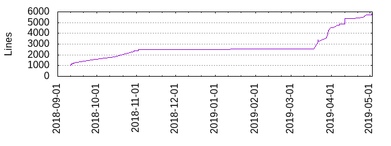

% Backendpräsentation
% 06.05.2019
% Team Backend

# Das Projekt

## Zeilen

## Eckdaten

- Spring Boot
- CI: Jenkins
- GitHub / GitHub-Workflow
- Scrum

# Jugend Forscht

## Jugend Forscht

> Das Rad nicht neu erfinden, lieber radeln lernen.

### Dinge, die neu waren

- REST
- ORM
- Security

## Jugend Forscht

### Recherche **vs** Implementierung

> Recherche als Luxus

- `@Validated`
- `@Query`
- `@Initbinder`

## Jugend Forscht

### Alternativlos

Wäre es ohne Framework leichter gewesen?

Ist Spring Boot das richtige Framework?

# Motivations- / Wissensverteilung

## Lines of Code

## Motivations- / Wissensverteilung

### Wissen

- Am anfang war's fair

- _reinfuchsen_

### Motivation

- pull statt push

- **Fuckup:** _Spaß_

### Henne-Ei?

# "Qualität"

## Qualität

### Definition of Done

- _schwach_
- _irrelevant_

### Tests

> Ist mir die Zeit nicht wert, weil wir arbeiten für die Tonne

- Feature **vs** Qualität

- warum Qualität?

# API-Spec / Koordination Frontend

## API-Spec schreiben

## API-Spec schreiben

### 2018

- keinen interessierts
- over the fence
- **Low light**: Last-Minute Änderung
    - 2 Reviewer

### 2019

_Prozess: kollaboratives schreiben_

- funktioniert relativ ok
- hängende Pull Requests

## Fragen stellen

# ScrumBut

## ScrumBut

### Formel:

$$\text{ScrumBut} \quad \text{Reason} \quad \text{Workaround}$$

## ScrumBut

| ScrumBut | Reason | Workaround |
| ------ | ------ | -------- |
| Wir machen Scrum, ABER | wir arbeiten nicht täglich | deshalb sind die Dailys nicht _daily_. | 
| Wir machen Scrum, ABER | keiner Interessiert sich für unsere Software | daher liefern wir nichts. |
| Wir machen Scrum, ABER |  wir bekommen kein Feedback vom Kunden | daher entwickeln wir das, was unser PO sich ausdenkt. |

# Abschlussgedanken unsererseits

## Abschlussgedanken unsererseits

- Der Code ist ok.
- Uni und Projek parallel ist eine Herausforderung.
